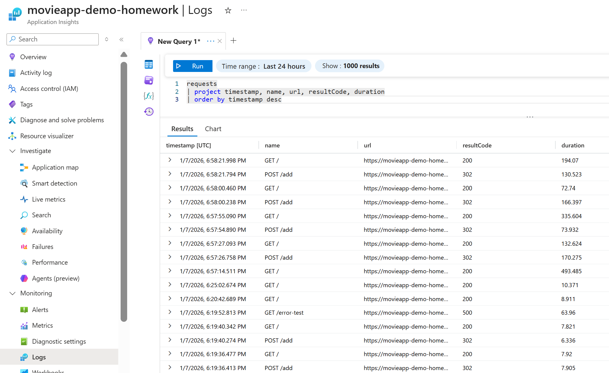
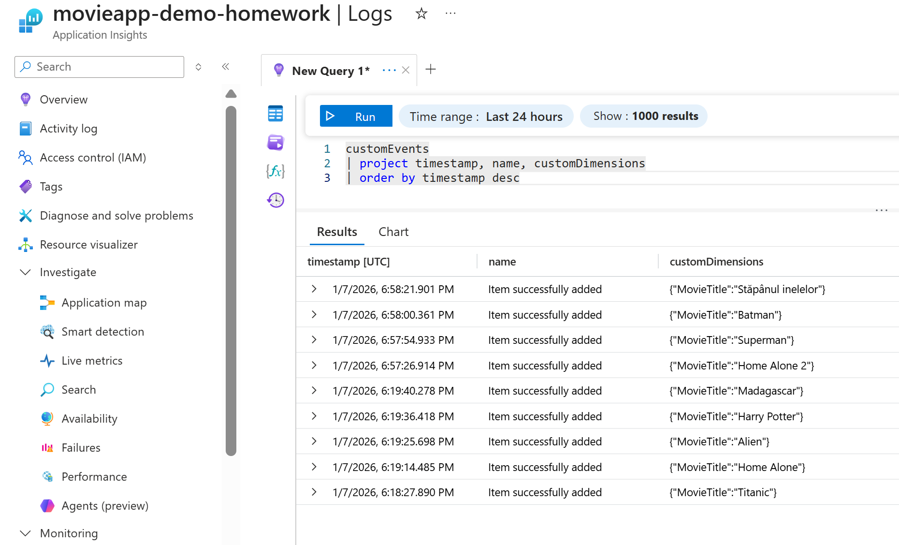
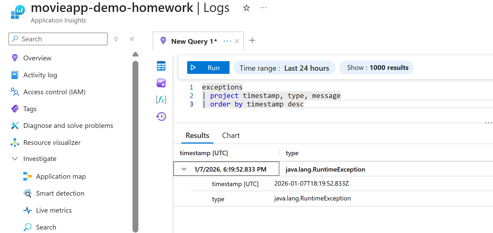
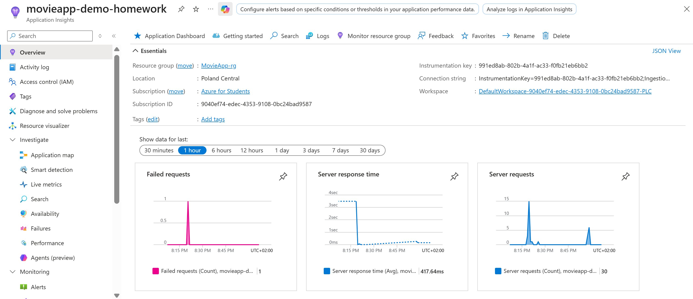

# Homework 3 – Application Telemetry with Azure Application Insights

## Obiectiv
Scopul acestei teme este integrarea **Azure Application Insights** într-o aplicație web și utilizarea acestuia pentru colectarea, analiza și vizualizarea telemetriei în timp de execuție.  
Accentul este pus pe **observabilitate**, nu pe complexitatea aplicației.

---

## URL public al aplicației
https://movieapp-demo-homework.azurewebsites.net/

---

## 1. Integrarea Azure Application Insights
Aplicația este conectată la **Azure Application Insights** și trimite cu succes date de telemetrie care sunt vizibile în Azure Portal.

### Configurare Application Insights
- Aplicația utilizează **Application Insights SDK pentru Spring Boot** (configurat prin `pom.xml`).
- Conexiunea cu Application Insights este realizată prin **connection string** definit în fișierul `application.properties`.
- Telemetria este colectată automat pentru request-uri HTTP, iar manual pentru evenimentele de business.

---

## 2. Telemetrie de performanță pentru request-uri HTTP
Pentru fiecare request HTTP, aplicația emite automat următoarele informații:
- timestamp-ul request-ului
- metoda HTTP (GET, POST)
- endpoint-ul accesat
- codul de status HTTP
- durata request-ului (în milisecunde)

Aceste date sunt vizibile în **Application Insights Logs**, tabela `requests`.

---

## 3. Business Logging (logare evenimente de business)

### Eveniment de succes
La adăugarea cu succes a unui film, aplicația înregistrează manual un eveniment de tip business.


### Gestionarea și logarea erorilor
Aplicația include un mecanism explicit pentru generarea și logarea erorilor.

- Endpoint-ul `/error-test` aruncă intenționat o `RuntimeException`
- Request-ul returnează cod HTTP **500**
- Eroarea este înregistrată în **Application Insights** și apare în tabela `exceptions`

Acest mecanism este folosit pentru a demonstra colectarea telemetriei de tip error.

---

## 4. Eveniment custom din frontend
Aplicația trimite un eveniment custom către Application Insights din **codul frontend**, atunci când utilizatorul apasă butonul **Add**.

Caracteristici:
- Evenimentul este trimis din browser.
- Numele evenimentului: `AddCheck`
- Include proprietăți custom (ex: acțiunea efectuată)
- Evenimentul apare în tabela `customEvents` din Application Insights Logs

---

## 5. Health Endpoint
Aplicația expune un endpoint de tip health check:


Caracteristici:
- Returnează HTTP **200** atunci când aplicația este funcțională
- Request-urile către acest endpoint apar în Application Insights
- Durata request-ului este vizibilă în telemetrie

---

## 6. Verificare în Azure Portal
Folosind **Application Insights Logs**, se pot observa:
- request-uri reușite și eșuate
- durata request-urilor
- request-uri către endpoint-ul `/health`
- evenimente custom din frontend
- excepții generate de aplicație

---

## Interogări KQL utilizate

### Request-uri HTTP cu durată și status

```kql
requests
| project timestamp, name, url, resultCode, duration
| order by timestamp desc
```



### Evenimente custom din frontend

```kql
customEvents
| project timestamp, name, customDimensions
| order by timestamp desc
```



### Excepții generate de aplicație

```kql
exceptions
| project timestamp, type, message
| order by timestamp desc
```



### Dashboard Application Insights


